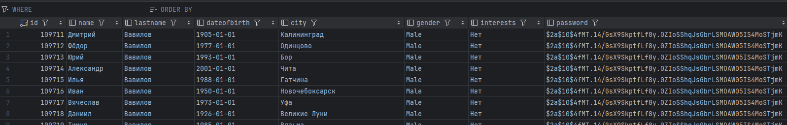
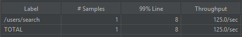
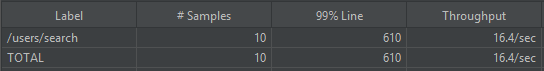
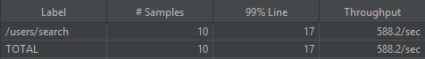
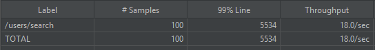
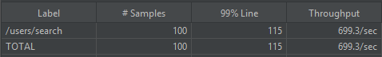
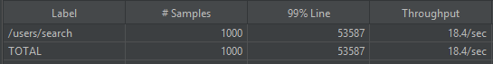
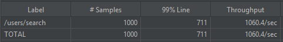

# Приложение Highload

## HW1

### Запуск

1. `cd my-project`
2. `docker compose up --build -d`

### Взаимодействие

#### В приложении используется аутентификация по JWT токену

##### UI
1. По адресу localhost:8080 запустится MVC-приложение.
2. Чтобы зарегистрироваться, необходимо перейти на форму регистрации и заполнить все необходимые поля. ВНИМАНИЕ: Пароль необходимо запомнить.
3. Чтобы посмотреть список пользователей необходимо аутентифицироваться по ID пользователя (у первого пользователя ID = 1) и паролю.
4. После этого можно обращаться к списку пользователей, а также к анкете каждого пользователя.

##### Postman
К коду проекта приложена Postman коллекция Highload.postman_collection.json.

## HW2

### Проведение нагрузочного тестирования эндпоинта /users/search

Цель: определить latency и throughput эндпоинта "/users/search"  

Сценарии:
1. 1 пользователь пытается найти пользователя по первой букве имени и фамилии
2. 10 пользователей пытаются найти пользователя по первой букве имени и фамилии
3. 100 пользователей пытаются найти пользователя по первой букве имени и фамилии
4. 1000 пользователей пытаются найти пользователя по первой букве имени и фамилии

### Оптимизация приложения

Цель: оптимизировать работу эндпоинта "/users/search"

Для оптимизации приложения необходимо проиндексировать поля таблицы users.

Так как для поиска пользователя используются поля name и lastname, то необходимо создать индекс по этим полям.  
Запрос `SELECT count(*) from (SELECT DISTINCT name from users);` показывает, что в БД 138 уникальных имен.  
Запрос `SELECT count(*) from (SELECT DISTINCT lastname from users);` показывает, что в БД 1006 уникальных фамилий.  
Кардинальность поля lastname выше, следовательно индекс стоит создавать по lastname.

Создание индекса:  
`CREATE INDEX idx_lastname ON users(lastname VARCHAR_PATTERN_OPS);`

Пояснение: в PostgreSQL для данных типа varchar при использовании оператора LIKE 
необходимо указать класс оператора индекса VARCHAR_PATTERN_OPS.

### Сравнение до и после оптимизации
1. 1 пользователь  
До:  
  
Latency: 135ms  
Throughput: 7.4/sec  
Время выполнения: < 1 sec  
После:  
  
Latency: 8ms  
Throughput: 125.0/sec  
Время выполнения: < 1 sec  
2. 10 пользователей  
До:  
  
Latency: 610ms  
Throughput: 16.4/sec  
Время выполнения: < 1 sec  
После:  
  
Latency: 17ms  
Throughput: 588.2/sec  
Время выполнения: < 1 sec  
3. 100 пользователей  
До:  
  
Latency: 5534ms  
Throughput: 18.0/sec  
Время выполнения: 5 sec  
После:  
  
Latency: 115ms  
Throughput: 699.3/sec  
Время выполнения: < 1 sec  
4. 1000 пользователей  
До:  
  
Latency: 53587ms  
Throughput: 18.4/sec  
Время выполнения: 57 sec   
После:  
  
Latency: 711ms  
Throughput: 1060.4/sec  
Время выполнения: < 1 sec  